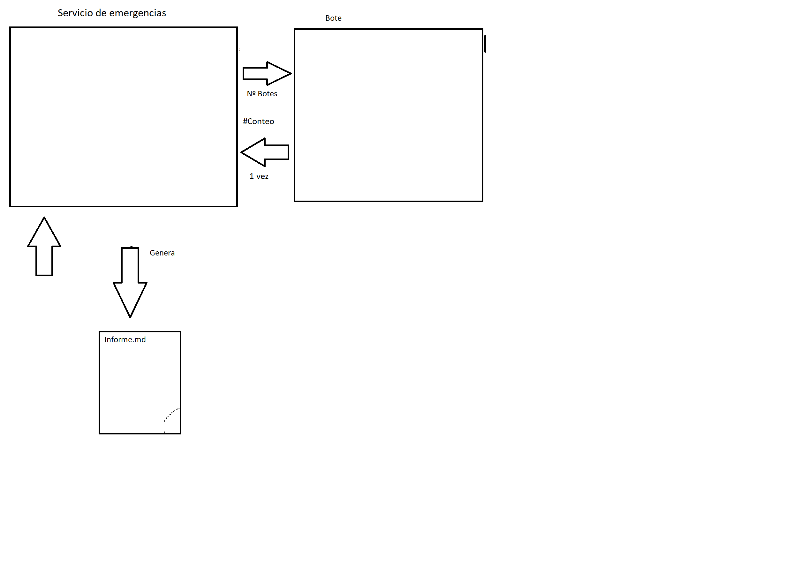
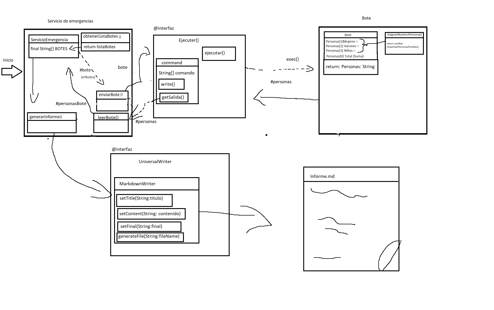

# Gestor del Titanic

***Miembros del grupo:*** Aitor Rebato, Erik De La Cruz

## Analisis del problema

Se pide implementar un programa que genere un documento sobre la cantidad de personas en cada bote.

Cada bote tiene una cantidad de personas que debe ser anotado de manera individual

Hay 20 botes en total cada uno con un identificador distindo

Hay personas que no se salvarán, por lo que no hay que contar que sobren

Los botes tardan de 2 a 6 segundos en contabilizar las personas que hay en el

Por lo que el programa tendrá que ver las personas que hay en cada bote y generar el informe con los datos de cada bote

---

## Diseño de la solución

### Arquitectura

Explicación: Necesitamos un programa principal que gestione los botes, los lance, reciba la información y escriba el informe, los botes son gestionados de manera individual, tiene que recibir el numero de bote que le corresponde.

Funcionamiento:

- Iniciamos el programa
- Servicio de emergencias genera 20 botes
- Como los botes tardan de 2 a 6 segundos en ejecutarse, el programa deberá funcionar de manera *asincrona* y *bloqueante*, de esta manera cuando estan todos los botes en el mar, comienza a intentar leerlo
    > El tiempo de espera será el tiempo del bote que mas tardó en ejecutarse
- Los botes devuelven la cantidad de personas que contienen
- Con los datos de los botes se generará el informe final

### Componentes

***Servicio de emergencia:*** Recibe internamente la lista de los botes para tenerla en un array, lleva los botes al metodo `enviarBote()`, cuando todos los botes estan enviados, hace la función `leerBote()` para obtener un listado de las personas de todos los botes, finalmente manda esta información a `generarInforme()` para generar el informe.

***Ejecuter:*** Es una interfaz que recibe un comando de `enviarBote` y lo ejecuta de manera asincrona, en este caso lanza bote y recibe su información para enviarla a `leerBote()`.

***Bote:*** Es ejecutado la cantidad de botes que tenga el barco, tiene una función que le asigna un numero de personas sin pasarse de la cantidad maxima en este caso 100 `asignarNumeroPersona()` , y devuelve el numero de personas que hay.

***UniversalWriter:*** Se ejecuta desde `generarInforme()` para crear el `informe.md` final donde esta escrita la cantidad de personas en cada bote.

### Protocolo de comunicación

`Bote` enviará la información a través de un `System.out.print` para poder leer la salida estandar del proceso, y lo mandara con un formato ([Numero de Mujeres] [Numero de varones] [Numero de niños] [Total] ) separados con un espacio para su procesamiento en `generarInforme()`

### Plan de pruebas

Usaremos **JUNIT** y **Mockito** para esta parte y probaremos:

**Bote:** Lo ejecutaremos 100 veces y de esas 100 veces ninguna deberá traer un valor total de personas mayor a 100, se simularán los datos de entrada y que saque el conteo de personas bien.

**Ejecuter:** le mandaremos un programa que ejecute simple y probar que `getSalida()` lea bien, tambien probaremos a ejecutar un comando erroneo y que `getSalida()` tenga el codigo de error.

**UniversalWriter:** Le pondremos a generar un informe y verlo que salga bien

**ServicioDeEmergencias:** Se simularán los datos de los botes que reciba para comprobar que genera el informe final correctamente.

---

## Manual de usuario

Para ejecutar el programa se debe lanzar `ServicioEmergencias.java`, y esperar a que en /informe salga el `informe.md`.

Si se quieren cambiar la cantidad maxima de personas en cada bote: meterse en `Botes.java` y cambiar el valor del atributo cantidadMaximaPersonas (Cambiarlo despues con respecto)

Si se quieren cambiar la cantidad maxima de botes lanzados, ir a `ServicioEmergencias.java` y cambiar el valor del atributo (pensar despues como se llama)

---

## Elementos destacables del desarrollo

A la hora de recibir los datos de los botes se ha conseguido que el tiempo de espera sea el minimo.

---

## Problemas encontrados

